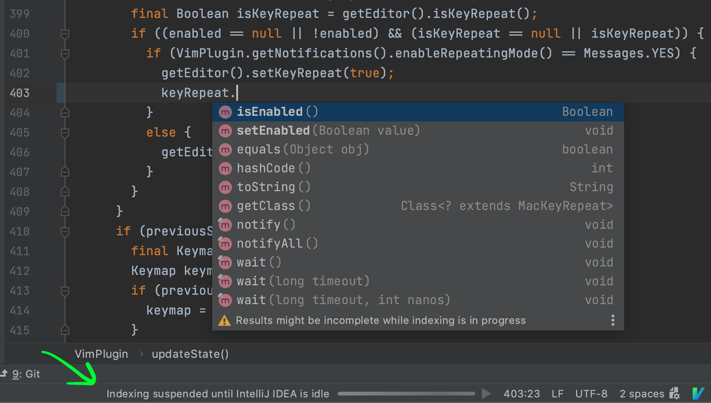
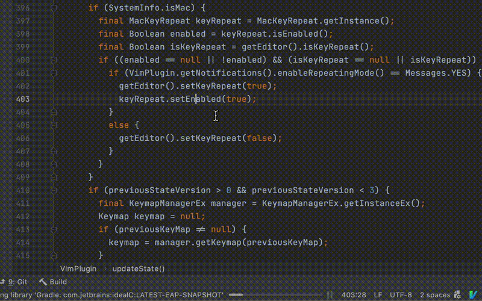
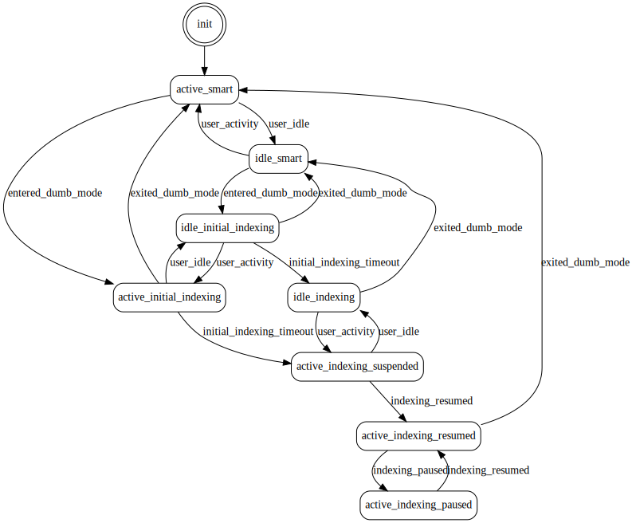

# Idle Indexing plugin

The **Idle Indexing** plugin makes the UI of your IDE more responsive by allowing it to index files only when the IDE is idle.

## Rationale

Have you ever noticed your IDE becomes less responsive when it's indexing files during the startup or on opening a project?

The **Idle Indexing** plugin allows your IDE to **index files only when the IDE is idle** and suspends indexing immediately when the IDE becomes active. The plugin **frees up your CPU, so it can be very responsive** to your keyboard input and mouse events. The default idle timeout is 3 seconds.

Pros:

* **More responsive UI** ⚡ while indexing is in progress

Cons:

* Incomplete code insight results while indexing is in progress
* The IDE disables some actions while indexing is in progress

⬇️ Install the Idle Indexing plugin and check if it improves your experience during indexing.

Please ⭐ [rate the plugin](https://plugins.jetbrains.com/plugin/15173-idle-indexing/reviews) or 💬 [write a review](https://plugins.jetbrains.com/plugin/15173-idle-indexing/reviews)! 🙏 I really need your feedback to make the plugin better!

## Idle Indexing in action

On the GIF below you can see that the plugin suspends indexing while I'm typing my code. I have my code completion, but the results might be incomplete during indexing. The plugin resumes indexing after 3 seconds of inactivity.

## Installation

1. Install the **Idle Indexing** plugin in "File | Settings | Plugins | Marketplace"
2. Restart your IDE

## Why does your IDE index files?

The IDE indexes files to make lots of code insight features faster, often as fast as you type your code:

* Code completion
* Go to definition
* Find usages
* Rename refactoring
* Search Everywhere
* Type hierarchy
* And so on

The price to pay here is time to index all your project files and its dependencies. Full indexing happens only once on opening your project for the first time. Then the IDE updates the index incrementally when you add project files or install new libraries as project dependencies.

## Why is it OK to postpone indexing?

So you need your IDE to have indexes for faster code insight, but want it to remain responsive when it is indexing files. The Idle Indexing plugin offers a solution: index files only when the IDE is idles, so it doesn't affect the UI responsiveness. But is it OK to work with your IDE while indexing is incomplete? It depends on whether you are OK with incomplete results for code insight during indexing:

* Code completion lists might be incomplete
* It might be not possible to go to the definitions of some references
* Some un-indexed results might be missing in Search Everywhere
* And so on

For all these situations the IDE will clearly indicate that "Results might be incomplete while indexing is in progress". For some programming languages like Java these incomplete results are better than for other languages. The situation with incomplete results in programming languages will improve in future versions.

## The Idle Indexing algorithm

This statechart diagram shows the logic behind idle indexing:

